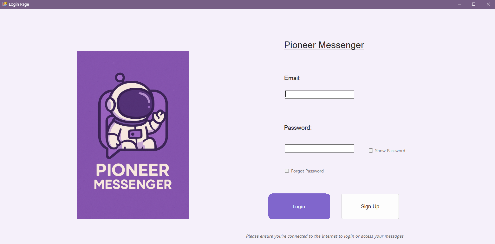
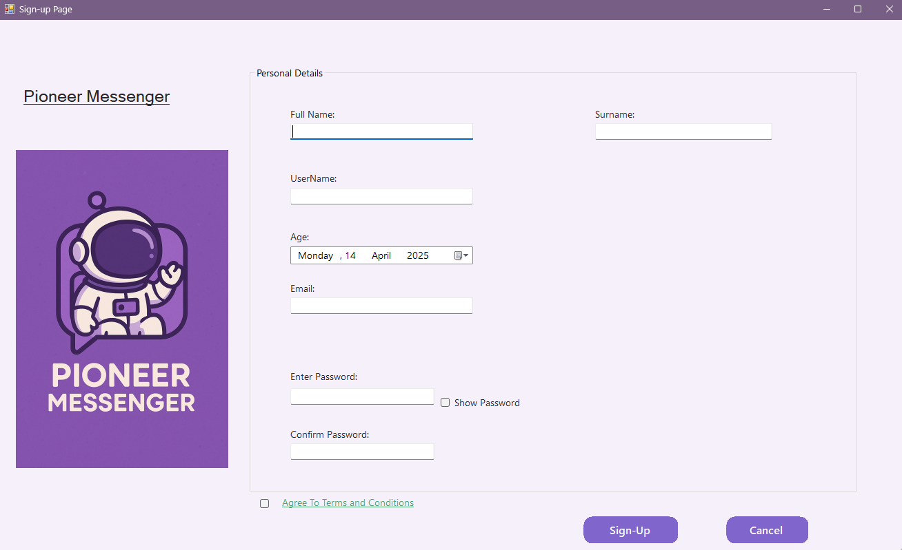
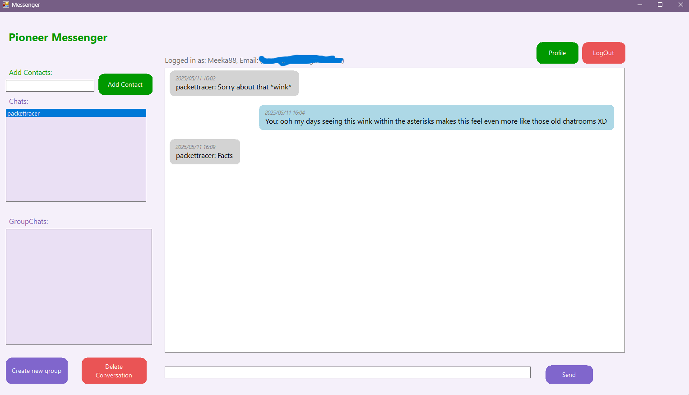
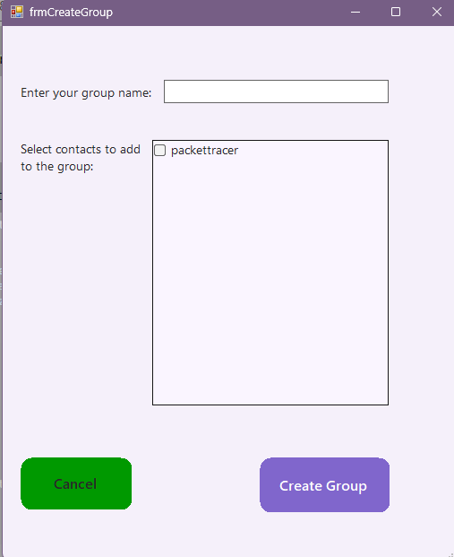

# Packet Pioneers - Text Messaging App

## Overview
Intended to be a portable text messaging application designed for Windows (with potential cross-platform support) that enables users to send and receive individual and group messages over the Internet. The app features a user-friendly GUI and works over the internet.

## Features
- **Windows Compatibility**: Runs on Windows 10/11
- **User-Friendly GUI**: Intuitive interface for easy messaging
- **Real-Time Messaging**: Send and receive text messages instantly
- **Individual & Group Chats**: Support for both one-on-one and group conversations
- **Internet-Based**: Works over the Internet (not limited to LAN)
- **Portable**: Runs directly without installation
- **Support**:  For application code email [Microsoft(Mekayla)](mailto:mmekayla05@outlook.com) or [Gmail(Schalk)](mailto:schalkvanwyk08@gmail.com)

In addition, a cost-optimised office network infrastructure using VLAN segmentation, scalable architecture, and bandwidth management (50Mb/s wired, 10Mb/s wireless) to support business growth while minimising expenses, a network infrastructure is designed.

## Packet Tracer Network Design
Enterprise network solution for a 100×50m office building.

### Network Requirements
- **13 Offices**: 2-4 people each, 4 wired ports per office
- **Technicians' Office**: Direct server room access
- **Reception Area**: Guest WiFi + staff access
- **Machine Room**: Centralized network infrastructure
- **Open Floor Space**: 75-120 people capacity

### Key Features
- **Segmented VLAN Architecture**
- **Enterprise-grade Cisco Equipment**
- **Dual Connectivity**:
  - Wired: 50Mb/s synchronous
  - Wireless: 10Mb/s synchronous
- **Centralized Services**: DHCP, DNS, NAT

### Design Specifications
| Area | Wired Ports | Wireless Devices | Special Requirements |
|------|------------|------------------|-----------------------|
| Offices | 52 | 104-208 | Isolated network |
| Technicians | 6 | 16 | Server room access |
| Reception | 2 | 4-8 | Guest network |
| Machine Room | N/A | N/A | Core infrastructure |

## Team Members
| Name | Role Assigned                                |
|------|----------------------------------------------|
| Schalk Van Wyk| Building Messenger App              |
| Neo Hlumbene| Designing/Creating Network Topology   | 
| Lesedi Mileng | Designing/Creating Network Topology |
| Mekayla Moyikwa | Building Messenger App            |
| Selaelo Phosa | Designing/Creating Network Topology |

## Technology Stack
### Messaging App
- **Frontend**: Windows Forms (.NET 6)
- **Backend**: Firebase Realtime Database
- **Security**: Firebase Authentication
- **Networking**: HTTPS/REST API    

### Network Design
- **Core Switch**: Cisco Catalyst 3650
- **Access Switches**: Cisco 2960
- **Security**: ASA Firewall
- **Wireless**: Cisco WLC 2504                  |

## Installation & Usage
### Prerequisites
- Windows 10/11 (64-bit)
- [*Optional*: .NET Runtime if required]

1. **Download** the Pioneer_Messenger.zip above and extract the files.
   1.1 Open the Debug folder and double-click the setup application.
2. **Follow the** installation wizard (Admin rights may be required)
   *A shortcut will be created on your desktop*
4. Launch from **Desktop** or **Start Menu** shortcut.

## Application Preview

### Login Screen

*Secure authentication with email/password*

### Main Chat

*Clean messaging interface with conversation history*

### Group Chat

*Group creation interface*
